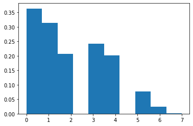
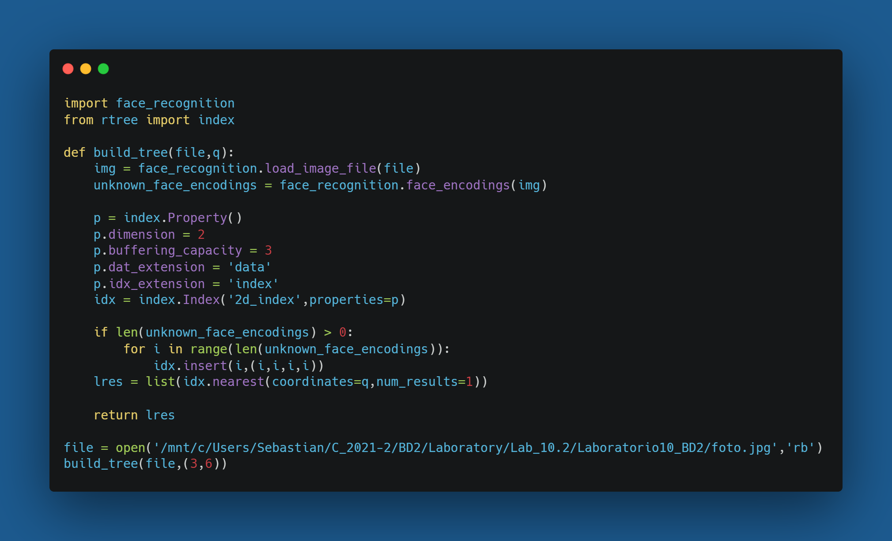

# Laboratorio 10 Base de Datos 2
## Integrantes

* Sebastian Quispe
* Christian Salazar
## Pregunta 1
Investigue el tamaño de los vectores característicos y como son 
obtenidos en la librería de referencia.

### Respuesta

Los vectores característicos se mapean en un espacio en 2 dimensiones que cuenta con un puntero al registro del objeto.

## Pregunta 2

### Histograma de las distancias obtenidas

## Pregunta 3

